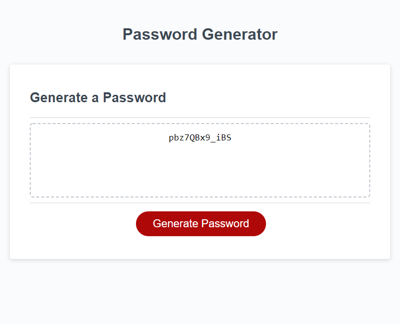

# 03 JavaScript: Password Generator

## My Task

I was required to modify the starter code given to me to create an application that enables the User to generate a random password based on criteria they've selected. 

## User Story

```
AS AN employee with access to sensitive data
I WANT to randomly generate a password that meets certain criteria
SO THAT I can create a strong password that provides greater security
```

## Acceptance Criteria Met

```
1. When the User clicks the button "Generate Password" they are presented with a series of prompts for password criteria

2. When prompted for the length of the password, User chooses a length of at least 8 characters and no more than 128 characters

3. Through a series of prompts, the User is able to confirm whether or not to include lowercase, uppercase, numeric, and/or special characters

4. Input is validated and at least one character type is selected or user is returned to beginning of prompt cycle

5. When all prompts are answered the password matching the criteria is written to the provided password box

```

## Screen Shot

The following image shows the web application's appearance and functionality:



## Link to Deployed App
https://chuck2076.github.io/PasswordGenerator_CRS/

## Grading Requirements

This homework is graded based on the following criteria: 

### Technical Acceptance Criteria: 40%

* Satisfies all of the preceding acceptance criteria plus the following:

  * The homework should not produce any errors in the console when you inspect it using Chrome DevTools.

### Deployment: 32%

* Application deployed at live URL.

* Application loads with no errors.

* Application GitHub URL submitted.

* GitHub repository that contains application code.

### Application Quality: 15%

* Application user experience is intuitive and easy to navigate.

* Application user interface style is clean and polished.

* Application resembles the mock-up functionality provided in the homework instructions.

### Repository Quality: 13%

* Repository has a unique name.

* Repository follows best practices for file structure and naming conventions.

* Repository follows best practices for class/id naming conventions, indentation, quality comments, etc.

* Repository contains multiple descriptive commit messages.

* Repository contains quality readme file with description, screenshot, and link to deployed application.

## Review

You are required to submit the following for review:

* The URL of the deployed application.

* The URL of the GitHub repository, with a unique name and a readme describing the project.

- - -
© 2021 Trilogy Education Services, LLC, a 2U, Inc. brand. Confidential and Proprietary. All Rights Reserved.
